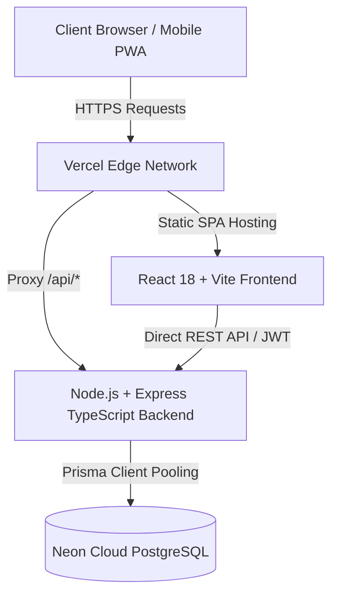

# ⚔️ Life RPG — Gamified Habit & Productivity Ecosystem

[](https://frontend-chi-eight-54.vercel.app)
[](https://liferpg-qx8y.onrender.com)
[](https://neon.tech)
[](https://www.typescriptlang.org/)
[](https://www.prisma.io/)

Turn your real life into an epic role-playing game. Life RPG transforms daily habits, fitness routines, study sessions, and work tasks into interactive quests. Earn XP on a non-linear leveling curve, train six character attributes, maintain streaks, earn gold, buy cosmetics in the item shop, and fight world bosses — all backed by a resilient cloud PostgreSQL database.

---

## 🌐 Live Production Deployments

* **Web Application (Vercel):** [https://frontend-chi-eight-54.vercel.app](https://frontend-chi-eight-54.vercel.app)
* **API Backend (Render):** [https://liferpg-qx8y.onrender.com](https://liferpg-qx8y.onrender.com)
* **Cloud Database:** Neon Serverless PostgreSQL (AWS `us-east-2`)

---

## ✨ Key Features

### 🛡️ 1. Hero Profile & Customization
- **Personalized Avatars:** Choose from high-fantasy RPG presets or provide custom image URLs.
- **Global Character Sync:** Instant avatar and level propagation across the desktop sidebar, mobile navigation, hero status cards, and settings without page reloads.
- **Character Attributes:** Real-life tasks directly train 6 RPG stats:
  - ⚔️ **Strength** (Fitness & Sports)
  - 🧠 **Intellect** (Coding & Science)
  - 🧘 **Discipline** (Mindfulness & Focus)
  - 💖 **Vitality** (Sleep & Nutrition)
  - 🎨 **Creativity** (Writing & Art)
  - 🤝 **Social** (Networking & Community)

### 📜 2. Server-Enforced Quest Engine
- **Full CRUD:** Create, edit, complete, categorize, and delete quests.
- **Zero Client-Trust:** XP, gold rewards, and attribute boosts are strictly calculated on the server from difficulty multipliers (`Easy`, `Medium`, `Hard`, `Epic`).
- **Dynamic Leveling Math:** Non-linear curve:
  $$\text{XP Required for Level } N = \text{round}(100 \times N^{1.5})$$
- Multi-level progression correctly handles large XP bursts in a single quest.

### 💰 3. Virtual Economy, Shop & Inventory
- **In-Game Economy:** Earn gold solely through real-world discipline and accomplishment.
- **Item Shop:** Purchase character avatars, rarity-tiered titles (Common, Rare, Epic, Legendary), custom badges, and theme accents.
- **Transactional Integrity:** Purchasing is guarded by atomic Prisma database transactions to prevent double-spending.
- **Inventory System:** Equip/unequip purchased gear dynamically reflected on the hero card.

### 🐉 4. World Boss Raids
- **Cooperative Accountability:** Completed quests deal damage to active World Bosses.
- **Boss Counter-Attacks:** Neglecting daily goals allows the boss to strike back, adding genuine stakes to personal procrastination.

### 🎉 5. Tactile Feedback & Procedural Audio
- **Web Audio API Engine:** Synthesizes retro RPG fanfares, chime chords, and coin pickup sounds purely through browser oscillators (no external audio files required).
- **Celebratory Micro-Animations:** Canvas confetti bursts, glowing XP gauges, and full-screen milestone level-up modals.

### 🔒 6. Security & Persistence
- **Dual Authentication:** Bcrypt password hashing, secure JWT tokens delivered via both `httpOnly` cookies and client-side authorization headers for high cross-domain reliability.
- **Strict Data Isolation:** Strict database relation checks guarantee users can only view and mutate their own data.
- **CORS & Reverse Proxying:** Configured with dynamic origin reflection and Vercel edge rewrites to eliminate cross-origin request failures.

---

## 🏗️ Architecture Overview



---

## 🛠️ Tech Stack

| Layer | Technologies |
| :--- | :--- |
| **Frontend** | React 18, Vite, TypeScript, Tailwind CSS, Framer Motion, Lucide Icons, Canvas Confetti |
| **Backend** | Node.js, Express.js, TypeScript, Zod, BcryptJS, JSON Web Tokens (JWT), Helmet, CORS |
| **Database & ORM** | Neon Serverless PostgreSQL, Prisma ORM 5.22 |
| **Hosting** | Vercel (Frontend SPA), Render (API Web Service) |

---

## 📁 Repository Structure

```text
life-rpg/
├── frontend/
│   ├── src/
│   │   ├── components/      # UI Components (UserAvatar, ProfileModal, Modals, Nav)
│   │   ├── context/         # AuthContext with auto-level synchronization
│   │   ├── pages/           # Dashboard, Quests, Shop, Bag, Boss, Settings
│   │   ├── services/        # Resilient API client with normalized endpoints
│   │   └── utils/           # Level engine, Sound FX synthesizer, Avatar presets
│   ├── vercel.json          # SPA routing + Render edge reverse-proxy
│   └── vite.config.ts       # Vite build configuration
│
└── backend/
    ├── prisma/
    │   └── schema.prisma    # PostgreSQL Prisma schema & migrations
    ├── src/
    │   ├── middleware/      # Auth guard, Rate-limiter, Error handling
    │   ├── routes/          # Auth, Quests, Character, Shop, Boss, Skills
    │   ├── services/        # Level computation, Streak engine
    │   └── app.ts           # Express server setup with CORS & Helmet
    └── tsconfig.json        # TypeScript configuration
```

---

## 🗄️ Database Schema (`prisma/schema.prisma`)

```prisma
datasource db {
  provider = "postgresql"
  url      = env("DATABASE_URL")
}

generator client {
  provider = "prisma-client-js"
}

model User {
  id            String             @id @default(uuid())
  name          String
  email         String             @unique
  passwordHash  String
  avatarUrl     String?
  level         Int                @default(1)
  xp            Int                @default(0)
  gold          Int                @default(0)
  currentStreak Int                @default(0)
  longestStreak Int                @default(0)
  lastQuestDate DateTime?
  createdAt     DateTime           @default(now())
  updatedAt     DateTime           @updatedAt

  attributes    CharacterAttribute?
  quests        Quest[]
  inventory     InventoryItem[]
  achievements  UserAchievement[]
  activity      ActivityLog[]
}

model CharacterAttribute {
  id         String @id @default(uuid())
  userId     String @unique
  user       User   @relation(fields: [userId], references: [id], onDelete: Cascade)
  strength   Int    @default(0)
  intellect  Int    @default(0)
  discipline Int    @default(0)
  vitality   Int    @default(0)
  creativity Int    @default(0)
  social     Int    @default(0)
}

model Quest {
  id          String    @id @default(uuid())
  userId      String
  user        User      @relation(fields: [userId], references: [id], onDelete: Cascade)
  title       String
  description String?
  category    String    // Coding | Study | Fitness | Health | Work | Personal | Reading | Creativity | Social
  difficulty  String    // Easy | Medium | Hard | Epic
  xpReward    Int
  goldReward  Int
  completed   Boolean   @default(false)
  completedAt DateTime?
  dueDate     DateTime?
  createdAt   DateTime  @default(now())
  updatedAt   DateTime  @updatedAt
}

model ShopItem {
  id          String          @id @default(uuid())
  name        String
  description String
  type        String          // Theme | Avatar | Frame | Badge | Title | Cosmetic
  price       Int
  rarity      String          // Common | Rare | Epic | Legendary
  icon        String
  createdAt   DateTime        @default(now())
  purchases   InventoryItem[]
}

model InventoryItem {
  id          String    @id @default(uuid())
  userId      String
  user        User      @relation(fields: [userId], references: [id], onDelete: Cascade)
  itemId      String
  item        ShopItem  @relation(fields: [itemId], references: [id])
  quantity    Int       @default(1)
  equipped    Boolean   @default(false)
  purchasedAt DateTime  @default(now())

  @@unique([userId, itemId])
}
```

---

## 🚀 Local Development Setup

### 1. Prerequisites
- Node.js (v18+)
- npm or yarn
- Neon PostgreSQL connection string (or local PostgreSQL)

### 2. Backend Setup
```bash
cd backend
cp .env.example .env

# Edit .env and supply your DATABASE_URL, JWT_SECRET
npm install
npx prisma generate
npx prisma db push
npm run seed
npm run dev
```
*Backend runs on `http://localhost:4000`*

### 3. Frontend Setup
```bash
cd frontend
npm install
npm run dev
```
*Frontend runs on `http://localhost:5173`*

---

## 🧪 Testing

Automated test suites verify server-side leveling calculations, streak algorithms, and quest reward mathematics:
```bash
cd backend
npm test
```

---

## 📹 Presentation & Demonstration Guide (3-5 Minutes)

1. **Sign Up / Login:** Register an adventurer account or login to reveal the persisted stats.
2. **Profile Customization:** Open the Hero Profile Picture Modal, select an avatar preset, and observe dynamic sync across the navigation and status card.
3. **Quest Creation & Execution:** Create a new "Epic" quest in "Coding". Complete it to trigger procedural audio fanfares, canvas confetti, XP gain, and a milestone level-up modal.
4. **Data Persistence Verification:** Press `F5` to prove that XP, level, and gold are committed in the Neon PostgreSQL database.
5. **Shop & Inventory:** Purchase an item using earned gold, equip it in your Bag, and observe real-time cosmetic status updates.
6. **Boss Battles:** Preview the active raid boss whose health bar is diminished by completed daily tasks.
